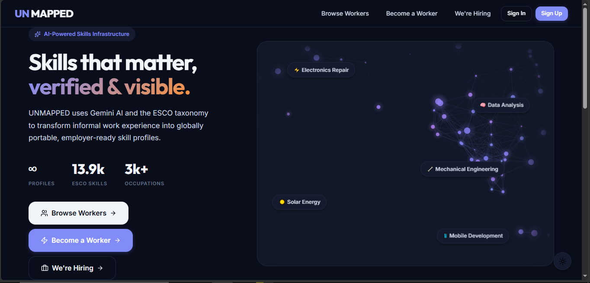

# UNMAPPED — Global Talent & Skills Infrastructure

UNMAPPED is a high-performance, AI-driven skills infrastructure designed to empower workers in emerging economies. It transforms unstructured work history into a portable, verified skills profile, assesses automation risk, and matches users with global market opportunities.



## 📱 Platform Modules

### 1. Become a Worker
This module is the entry point for talent. It allows individuals to transform their experience into a standardized, AI-verified profile.
- **Data Intake**: Users provide their name, location, education, and detailed work history.
- **AI Analysis**: The platform uses Gemini AI to map raw text to the **ESCO taxonomy**, extracting specific skills and occupations.
- **Profile Generation**: Generates a comprehensive dashboard showing skill confidence, automation risk assessments, and market opportunity matches.

| Step 1: Form | Step 2: Analysis | Step 3: Result |
| :---: | :---: | :---: |
|  |  |  |

### 2. Browse Workers
A marketplace view for employers and researchers to explore the global talent network.
- **Discovery**: View a curated list of workers across different regions.
- **Deep Dive**: Access detailed profiles including educational backgrounds, skill durabilities, and specialized expertise.
- **Verification**: Transparent display of AI confidence scores for each mapped skill.


### 3. We're Hiring
The employer-facing module for organizational growth and opportunity creation.
- **Job Posting**: Organizations can create detailed job listings specifying required skills, salary ranges, and custom application fields.
- **Application Management**: Track and manage incoming applications from the global talent pool.
- **Response Tracking**: Direct visibility into applicant matches and engagement.

| Job Creation | Active Postings |
| :---: | :---: |
|  |  |

---

## 🚀 Core AI Engine (Technical)

### 1. Skills Signal Engine (SSE)
- **What it does**: ESCO-anchored skills extraction and profiling.
- **Key Feature**: Anchors raw text to standard industry identifiers for maximum portability.

### 2. AI Readiness Lens (ARI)
- **What it does**: Evaluates the durability of a worker's skill set against automation trends (specifically calibrated for LMIC contexts).
- **Key Feature**: Provides a "Trend 2035" risk score and identifies "durable" vs. "vulnerable" skills.

### 3. Opportunity Matching (OMD)
- **What it does**: Integrates econometric data from ILOSTAT and the World Bank to identify reachable market signals.
- **Key Feature**: Calculates "Match Scores" based on current skills and local wage estimates.

---

## 🛠️ Tech Stack
- **Frontend**: React 19, Vite, TypeScript, Framer Motion, Lucide Icons.
- **Backend**: FastAPI (Python), Pydantic, Gemini AI (Google), Pandas.
- **Database**: Supabase (PostgreSQL) for persistence and authentication.

## ⚙️ Configuration & Setup

### 1. Environment Configuration
Create a `.env` file in both the `frontend/` and `backend/` directories.

**frontend/.env**:
```env
VITE_SUPABASE_URL=your_supabase_url
VITE_SUPABASE_ANON_KEY=your_supabase_anon_key
```

**backend/.env**:
```env
GEMINI_API_KEY=your_gemini_api_key
GEMINI_MODEL=gemini-1.5-flash-latest
```

### 2. Running Locally

#### Backend
```bash
cd backend
pip install -r ../requirements.txt
python main.py
```

#### Frontend
```bash
cd frontend
npm install
npm run dev
```

## 🔒 Security
- **Strict Gitignore**: All `.env` files and sensitive credentials are excluded.
- **Structured Settings**: Backend configuration managed through a typed `Settings` class.
- **Row Level Security**: Protected via Supabase RLS policies.
